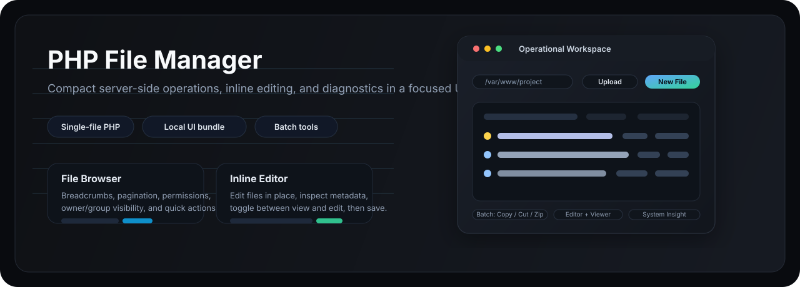

<p align="center">
  
</p>

<p align="center">
  <a href="https://www.php.net/">
    
  </a>
  <a href="https://tailwindcss.com/">
    
  </a>
  <a href="https://www.php.net/manual/en/install.php">
    
  </a>
</p>

<p align="center">
  Compact server-side file operations, inline editing, diagnostics, and batch workflows in a focused single-screen PHP interface.
</p>

<p align="center">
  <code>Single-file PHP core</code>
  <code>Local Tailwind UI bundle</code>
  <code>Batch operations</code>
  <code>Built-in diagnostics</code>
</p>

## Overview

This project is a compact PHP file manager designed for practical day-to-day server work: browsing directories, editing files, moving data around, checking system details, and running lightweight PHP-side function calls without leaving the interface.

The current repository packages the UI locally through `style.min.js`, which contains the Tailwind-generated CSS bundle plus the client-side interaction logic. That removes the heavier Tailwind Play CDN dependency while keeping the interface behavior intact.

## Feature Set

| Area | Included |
| --- | --- |
| Navigation | Home shortcut, root/parent traversal, breadcrumb path navigation, large-directory pagination |
| File operations | Upload, download, create file, create directory, rename, delete |
| Editor | Inline text editor, view/edit mode toggle, save back to disk, file metadata display |
| Metadata | Permission changes (`chmod`), timestamp editing, owner/group visibility |
| Batch tools | Multi-select delete, copy, cut, paste across directories, archive download |
| Compression | `ZipArchive`, `PharData`, and shell archiver fallback (`tar` / `zip`) |
| Diagnostics | PHP version, server software, disabled functions, cURL/database visibility |
| System insight | OS details, available binaries, storage usage, mount overview, hosts file preview |
| Runtime helper | Embedded PHP function runner with local form persistence |
| UX details | Toast feedback, persistent clipboard state, compact responsive layout |

## Interface Modules

### 1. File Browser

- Directory listing with folders first, then files
- Permission, owner/group, size, and modified-date visibility
- Quick actions for edit, download, rename, delete, permissions, and date changes
- Bulk selection bar for copy, cut, compress, and delete

### 2. Inline Editor

- Opens files directly inside the same interface
- Shows file size, ownership, permission string, and timestamps
- Supports fast switching between `View` and `Edit`
- Saves through the same PHP endpoint without needing a separate API layer

### 3. PHP Runner

- Lets you execute PHP functions with a single argument from the UI
- Keeps the last function name and arguments in `localStorage`
- Useful for lightweight environment inspection or quick one-off function calls

### 4. System Information Panel

- Web/PHP overview
- OS and binary visibility
- Security and permission context
- Storage usage and mount table
- Hosts file preview when readable

## Deployment Footprint

Runtime deployment only needs these two files in the same directory:

```text
filemanager.php
style.min.js
```

Repository-only files such as this `README.md` and `assets/overview.svg` are not required on the target server.

## Runtime Notes

| Topic | Notes |
| --- | --- |
| PHP | Works as a plain PHP file without a framework or database |
| Compression | Uses the best available method in this order: `ZipArchive`, `PharData`, then shell `tar` / `zip` |
| Upload flow | Supports normal upload handling and base64-based upload submission from the UI |
| Clipboard | Copy/cut state is stored in `localStorage`, so it survives directory navigation |
| Pagination | Directory listings are paginated in blocks of 500 items |
| Platform awareness | Handles both Linux-style and Windows-style environments where possible |
| External assets | Phosphor icons and Google Fonts are still loaded externally |

## Repository Layout

```text
.
|-- filemanager.php   # Core application and server-side logic
|-- style.min.js      # Local UI bundle: Tailwind CSS output + app JavaScript
|-- README.md
`-- assets/
    `-- overview.svg
```

## Intended Use

This is a high-trust operational tool. It can read and modify files, change permissions and timestamps, build archives, and call PHP functions directly from the interface. It is best suited for controlled admin, maintenance, lab, or internal tooling environments where that level of capability is intentional.

## Summary

The project keeps the deployment model small while still covering the workflows that matter most in a real file manager:

- fast navigation
- reliable file operations
- inline editing
- server and storage inspection
- practical batch actions

It is optimized for utility first, with a compact UI that stays readable during repetitive operational work.

[Back to top](#top)
